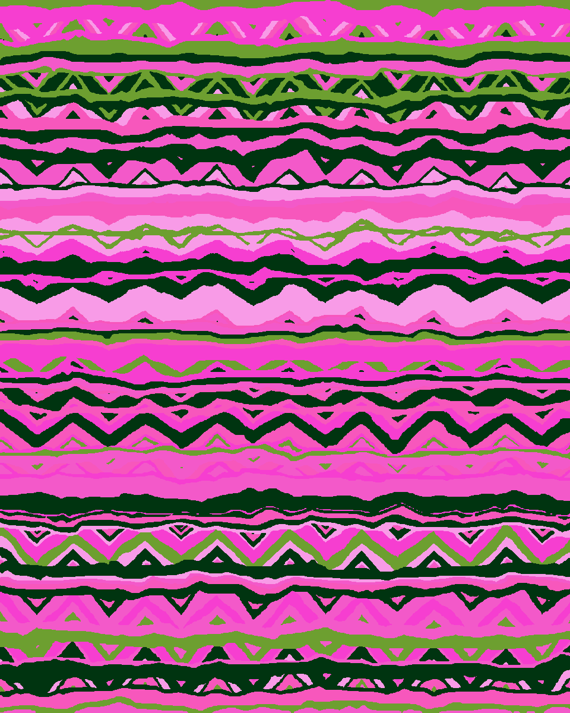

# autoRecolor

AI-powered image recoloring via palette manipulation in OKLAB color space.

Describe the color change you want in plain English — the local LLM figures out which palette colors to shift and by how much, then remaps every pixel in the image to match.



---

## How it works

1. **Analyze** — K-Means clusters the image into N dominant colors in OKLAB space (perceptually uniform, so clusters are more meaningful than plain RGB).
2. **Edit** — A local LLM (served via [Ollama](https://ollama.com)) receives the palette and your prompt, then calls tools (`update_color`, `adjust_hsl`, `relabel_color`) to mutate it.
3. **Recolor** — Every pixel is re-mapped from its nearest original cluster color to the new target color using smooth OKLAB interpolation.

---

## Requirements

- Python ≥ 3.11
- [Ollama](https://ollama.com) running locally with a tool-calling model  
  Default model: `qwen3.6:27b` (configurable in `src/autoRecolor/agent.py`)

---

## Installation

```bash
git clone https://github.com/StarAtNyte/autoRecolor.git
cd autoRecolor
pip install -e .
```

Or via Make:

```bash
make install
```

---

## Usage

### CLI (interactive)

```bash
autorecolor <image_path>
```

```
Analyzing photo.jpg...
  [0] ████ #3A5F8A  sky              42%
  [1] ██   #D4A96A  sand             18%
  ...

Commands:
  <prompt>   describe the recolor you want
  json       show raw palette JSON
  preview    save a recolored preview
  undo       revert last change
  quit       exit and save final result

You: make the sky a warm golden sunset
  ▶ adjust_hsl({"color_id": 0, "h_shift": -150, "s_shift": 20, "l_shift": -5})
  ✓ Shifted sky from blue to warm amber-gold

  [0] #3A5F8A → #8A6A1A  (sky → sky)

You: preview
  Preview saved: photo_preview.jpg

You: quit
Recoloring image...
Saved: photo_recolored.jpg
Saved palette preview: photo_palette_preview.jpg
```

### Web UI

```bash
autorecolor-server
# or
make run
```

Opens a local FastAPI server with a browser UI at `http://localhost:8000`.

---

## Available tools (used by the LLM)

| Tool | Description |
|------|-------------|
| `get_palette` | View current palette with hex, HSL, labels, and coverage % |
| `update_color` | Set a color to an exact hex value |
| `adjust_hsl` | Shift hue (±360°), saturation (±100), lightness (±100) |
| `relabel_color` | Rename a color's semantic label |
| `finalize` | Commit all changes and return a summary |

---

## Project structure

```
src/autoRecolor/
├── agent.py      # Ollama LLM agent + tool execution loop
├── analyze.py    # OKLAB K-Means palette extraction
├── cli.py        # Interactive CLI with undo history
├── palette.py    # Palette data model (hex ↔ HSL ↔ OKLAB)
├── recolor.py    # Pixel remapping engine
├── server.py     # FastAPI web server
├── static/       # Browser UI
└── utils.py      # Color space conversion helpers
```

---

## Configuration

| Setting | Location | Default |
|---------|----------|---------|
| Ollama model | `agent.py` → `MODEL` | `qwen3.6:27b` |
| Ollama base URL | `agent.py` → `OLLAMA_BASE` | `http://localhost:11434` |
| Number of palette colors | CLI call to `analyze_image` | `6` |

---

## License

MIT
